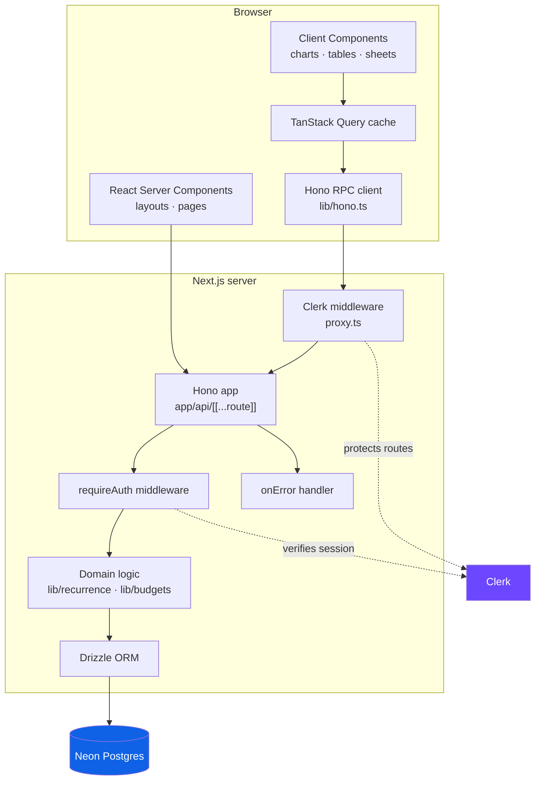
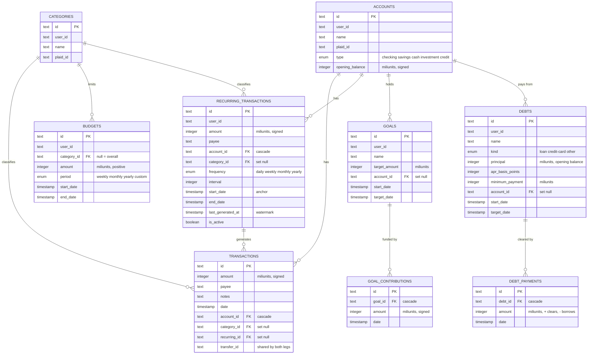
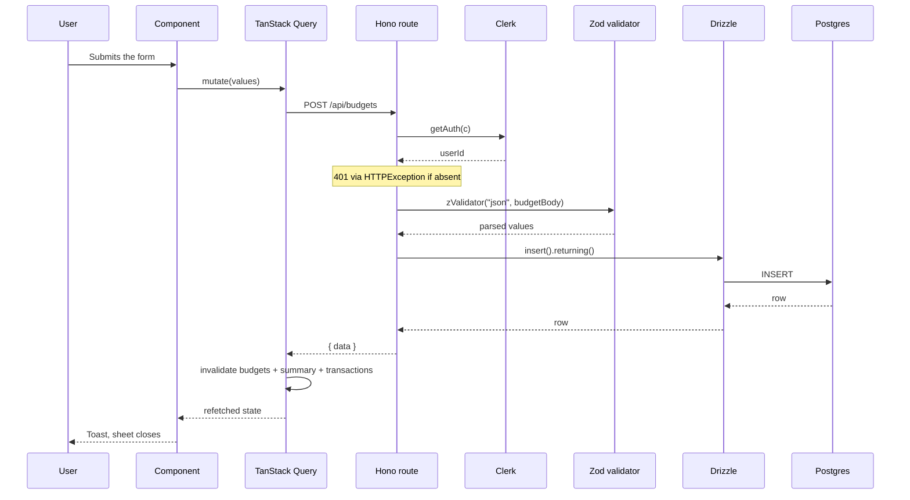
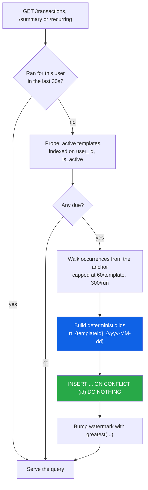

# Fintrack

A personal finance workspace built on Next.js 16 and Postgres. Track accounts and
transactions, watch net worth move day by day, import statements from CSV, set
budgets per category, move money between accounts, plan a debt payoff, and
schedule recurring transactions that enter themselves.

Built as a full-stack showcase: type-safe end to end (Drizzle → Hono RPC → React
Query), a Geist-derived design system with real dark mode, and a lint gate that
enforces SonarQube-style rules.

---

## Features

| | |
|---|---|
| **Accounts** | Bank accounts, cards and wallets, each with a type and an opening balance, so every account carries a live balance |
| **Net worth** | Assets, liabilities and net worth as of any date, plus a daily trend built from real balances rather than cash flow |
| **Categories** | Group spending and see where the money actually goes |
| **Transactions** | Full CRUD, bulk delete, sorting, filtering, pagination |
| **CSV import** | Map arbitrary columns onto amount/date/payee, then bulk-create |
| **Dashboard** | A balance sheet on top of income / expenses / remaining with period-over-period change, plus seven chart types |
| **Budget goals** | Per-category or overall limits on weekly, monthly, yearly or custom periods, with live progress and on-track / warning / over states |
| **Savings goals** | A target, a deadline and a contribution ledger, with pace measured against the time elapsed |
| **Transfers** | Move money between your own accounts as one linked pair of entries, kept out of income, expenses and budgets |
| **Debt payoff** | Loans and cards with APR and minimum payment, projected payoff date and interest, plus a snowball vs avalanche comparison for any extra payment |
| **Recurring transactions** | Daily, weekly, monthly or yearly schedules that materialise into real transactions — no cron, no queue, no extra infrastructure |
| **Theming** | Light, dark and system, on a fully tokenised design system |

---

## Tech Stack

| Layer | Choice | Why |
|---|---|---|
| Framework | **Next.js 16** (App Router, React 19) | RSC for the shell, client components where interactivity actually lives |
| API | **Hono** on a catch-all route handler | One fluent chain produces `AppType`, giving the frontend a fully typed RPC client with zero codegen |
| Database | **Neon Postgres** + **Drizzle ORM** | Serverless-friendly HTTP driver; Drizzle's schema doubles as the zod validation source via `drizzle-zod` |
| Auth | **Clerk** | Middleware-level route protection plus per-request `getAuth` inside Hono |
| Data fetching | **TanStack Query v5** | Centralised query-key factory, cross-feature invalidation |
| Tables | **TanStack Table v9** | Opt-in feature set, so only the row models used get bundled |
| Charts | **Recharts 3** | Every colour bound to a CSS variable, so charts theme with the app |
| Styling | **Tailwind v4** + shadcn/ui | CSS-first config; all design tokens live in `app/globals.css` |
| Validation | **Zod 4** | Shared between the API validators and the react-hook-form resolvers |
| Testing | **Vitest** | Pure logic (recurrence maths, budget periods, CSV mapping) covered without a database |

---

## Architecture



`AppType` is exported from the route chain and consumed by `hc<AppType>()`, so a
change to any handler's response shape becomes a compile error in the component
that renders it.

### Data model



An account balance is `opening_balance` plus every transaction on it. Transfer
legs are deliberately counted here — moving your own money changes two balances
even though it is neither income nor spending — which is the one place the rule
inverts from summaries and budgets.

Net worth splits those balances by **sign**, not by account type: anything above
zero is an asset, anything below it is a liability, and outstanding debt is added
to the liability side. An overdrawn current account is then a real liability and
an overpaid card is real money owed back to you, with no special cases. The type
only decides how a row reads and which way the opening balance is signed, so a
card is entered as the amount owed and stored below zero. The trend walks the
window forward one day at a time carrying a running balance per account, so every
point is a balance sheet rather than a cumulative sum of cash flow — all of it
pure maths in `lib/net-worth.ts`, tested without a database.

Money is stored as **miliunits** (integer thousandths) so no float ever touches a
balance. `transactions.recurring_id` is `ON DELETE SET NULL` on purpose: deleting a
schedule must never erase months of real financial history.

A transfer is not a table. It is a pair of transactions — one negative on the
source account, one positive on the destination — sharing a `transfer_id`. Every
account-scoped view and balance then stays correct with no special cases; the only
rule to remember is that summaries and budgets filter `transfer_id is null`,
because moving your own money is neither income nor spending. Both legs are
written in one statement and deleted together, so the ledger is never half a
transfer.

Debts run the same way as savings goals but in reverse: `principal` is the opening
balance and stays put, while `debt_payments` records what has been paid off (and,
as a negative amount, anything freshly borrowed). Rates live in basis points so
they stay integers, and every projection — payoff date, total interest, the
snowball and avalanche simulations — is pure maths in `lib/debts.ts`, tested
without a database.

### A mutation, end to end



### Recurring transactions without a cron

The hard constraint: the app must deploy with **no extra infrastructure** — no cron
provider, no queue, no new environment variables. Occurrences are therefore
materialised lazily, on read.



Four decisions carry this design:

1. **Deterministic primary keys are the idempotency mechanism.** The Neon HTTP
   driver has no interactive transactions, so `BEGIN … COMMIT` and advisory locks
   are unavailable. Every occurrence hashes to the same id in every process, and a
   single multi-row `INSERT … ON CONFLICT DO NOTHING` is atomic on its own. Two tabs
   loading at once produce identical ids; the loser is a silent no-op.
2. **Occurrence *N* is computed from the original anchor, never from *N−1*.**
   Iterating `addMonths(previous)` turns `Jan 31 → Feb 28 → Mar 28 → Apr 28`,
   permanently losing the "last day of the month" intent. Anchoring gives
   `Jan 31, Feb 28, Mar 31, Apr 30` — correct, and self-healing.
3. **All calendar maths runs on UTC fields, not date-fns.** `addMonths` and `format`
   read the process time zone, so a UTC-midnight date reads back as the previous
   local day on a negative-offset machine — generating different ids in development
   than in production. Instants are stored at 12:00 UTC so every real-world offset
   renders the intended calendar day.
4. **Nothing is ever generated past today.** The dashboard computes income and
   expenses straight from `transactions`; materialising next month's rent today
   would show money as already spent. The next date is derived from the rule for
   display instead.

`lastGeneratedAt` is a performance hint, never a correctness mechanism — if that
write is lost, the next run recomputes the same occurrences and the insert no-ops.

---

## Project Structure

```
app/
  (auth)/              Sign-in and sign-up, themed to match the app
  (dashboard)/         Sidebar shell, one folder per route
  api/[[...route]]/    Hono app: _middleware, _resource, and one file per resource
components/            App shell, charts, shared states, shadcn primitives in ui/
db/                    Drizzle schema and connection
features/<name>/       api/ (React Query hooks) · hooks/ (zustand sheet state) · components/
lib/                   Domain logic, constants, query keys, formatting
drizzle/               Generated SQL migrations
scripts/               migrate and seed
```

Each feature owns its data hooks, sheet state and forms. Shared behaviour is
factored out rather than duplicated: `createResourceRoutes` generates the CRUD
endpoints for accounts and categories, `ResourcePage` renders both list pages, and
`createNewSheetStore` / `createOpenSheetStore` back every sheet.

---

## Getting Started

**Prerequisites:** [Bun](https://bun.sh), a [Neon](https://neon.tech) database, and a
[Clerk](https://clerk.com) application.

```bash
git clone https://github.com/rizonkumar/Finance-SaaS-Platform.git
cd Finance-SaaS-Platform
bun install

cp .env.example .env    # then fill in the values

bun run db:migrate      # apply migrations
bun run db:seed         # optional sample data
bun run dev
```

Open <http://localhost:3000>.

### Environment

| Variable | Purpose |
|---|---|
| `NEXT_PUBLIC_CLERK_PUBLISHABLE_KEY` | Clerk client key |
| `CLERK_SECRET_KEY` | Clerk server key |
| `NEXT_PUBLIC_CLERK_SIGN_IN_URL` / `..._SIGN_UP_URL` | Auth route paths |
| `DATABASE_URL` | Neon Postgres connection string |
| `NEXT_PUBLIC_APP_URL` | Base URL the RPC client targets |

---

## Scripts

| Command | Description |
|---|---|
| `bun run dev` | Development server |
| `bun run build` / `start` | Production build and serve |
| `bun run typecheck` | `tsc --noEmit` |
| `bun run lint` / `lint:fix` | ESLint with `typescript-eslint` and `eslint-plugin-sonarjs` |
| `bun run format` / `format:check` | Prettier |
| `bun run test` / `test:watch` / `test:coverage` | Vitest |
| `bun run db:generate` | Generate a migration from the schema |
| `bun run db:migrate` | Apply migrations |
| `bun run db:seed` | Seed sample data |
| `bun run db:studio` | Drizzle Studio |

---

## Code Quality

The quality gate is enforced, not aspirational — CI runs typecheck, lint, format
check, tests and build on every push.

- **`eslint-plugin-sonarjs`** for cognitive complexity, duplicated string literals,
  identical functions, nested ternaries and redundant optionals.
- **`typescript-eslint`** with `strict` plus `noUncheckedIndexedAccess`,
  `noUnusedLocals`, `noUnusedParameters` and `noImplicitOverride`.
- **No `any`** anywhere in the codebase, and no `@ts-ignore` / `eslint-disable`
  escape hatches.
- **No comments.** Names and structure carry the meaning; anything that needed a
  comment to explain got extracted instead.
- **Prettier** with Tailwind class sorting, enforced by a `lint-staged` pre-commit hook.
- **Vitest** covers the logic where bugs actually live: month-end and leap-year
  recurrence, budget period boundaries, miliunit round-tripping and CSV mapping.

---

## Design System

A Geist-derived system, deliberately not a clone. Every colour, radius, shadow and
motion value is a token in `app/globals.css`; no component uses a raw hex.

- **Ten-step scales** in `oklch` where the step encodes intent: `100` background,
  `400` border, `700` solid fill, `900` secondary text, `1000` primary text.
- **Financial semantics** — green for income and under-budget, red for expenses and
  overspend, amber for approaching a limit. Never colour alone: every state also
  carries an icon or a label.
- **Dark mode** resolves through both the class the toggle sets and
  `prefers-color-scheme`, so it is correct before the user ever opens the toggle.
- **Geist Sans and Geist Mono**, with tabular figures on every currency and date so
  numeric columns align.
- **Motion** is short and physical, and disabled wholesale under
  `prefers-reduced-motion`.

---

## Licence

MIT
